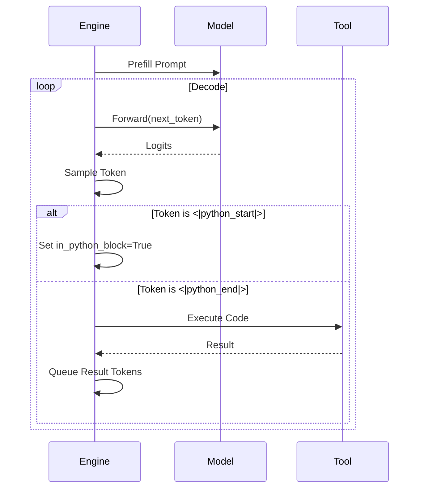

# Engine Module Documentation (`engine.py`)

The `engine.py` module is responsible for efficient inference streaming and tool execution.

## Overview

It provides the `Engine` class which wraps the `GPT` model to handle stateful generation, including KV cache management and handling of special tokens like tool calls (e.g., Python REPL).

## Classes

### `KVCache`
Manages the Key-Value cache for the Transformer.
- **Dimensions**: `[layers, 2 (k/v), batch, heads, seq, head_dim]`.
- **Methods**:
    - `insert_kv(layer_idx, k, v)`: Inserts new keys/values into the cache.
    - `prefill(other)`: Copies content from another cache (used for branching from a prefix).
    - `get_pos()`: Returns current position.

### `Engine`
Orchestrates the generation process.
- **Methods**:
    - `generate(tokens, num_samples, ...)`: Main generator.
        - Steps:
            1.  **Prefill**: Processes the initial prompt with batch size 1.
            2.  **Clone**: Replicates the KV cache for `num_samples`.
            3.  **Decode Loop**: Generates tokens token-by-token.
            4.  **Tool Use**: Detects `<|python_start|>`/`<|python_end|>`, executes code, and feeds output back.

### `RowState`
Tracks the state of a single generation sequence within a batch.
- `current_tokens`: All tokens generated so far.
- `forced_tokens`: Tokens waiting to be injected (e.g., tool outputs).
- `in_python_block`: Boolean flag.

## Tool Use Support

The engine includes a simple calculator tool (safe `eval`) to demonstrate tool use capabilities.
- `use_calculator(expr)`: Evaluates a math expression with a timeout.

## Diagrams

### Generation Process

