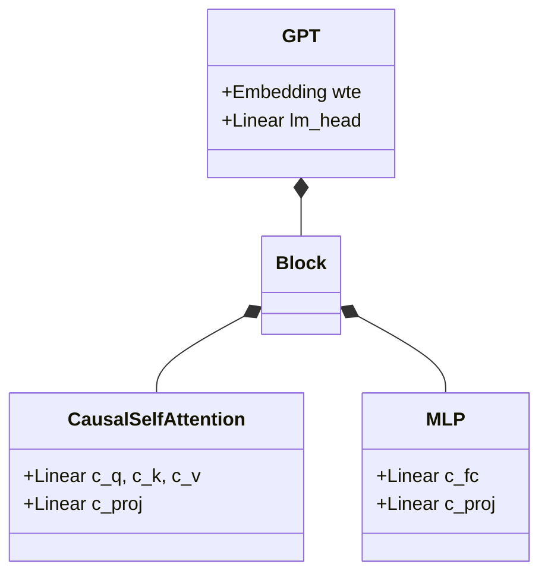

# GPT Module Documentation (`gpt.py`)

This module defines the core GPT model architecture used in `nanochat`. It implements a simplified yet widely used Transformer Decoder architecture.

## Overview

The `GPT` class is the main entry point, composed of a stack of `Block`s, each containing `CausalSelfAttention` and `MLP` layers.

### Key Features
- **Rotary Embeddings (RoPE)**: Applied to queries and keys for relative positional encoding.
- **RMSNorm**: Pre-normalization with no learnable parameters.
- **Grouped Query Attention (GQA)**: Supports separate numbers of query heads (`n_head`) and key/value heads (`n_kv_head`).
- **SwiGLU-like Activation**: `F.relu(x).square()` in `MLP`.

## Classes

### `GPTConfig`
Configuration dataclass for the model.
- `sequence_len`: Maximum sequence length (default: 1024).
- `vocab_size`: Vocabulary size (default: 50304).
- `n_layer`: Number of transformer layers.
- `n_head`: Number of attention query heads.
- `n_kv_head`: Number of key/value heads.
- `n_embd`: Embedding dimension.

### `GPT`
The main model class.
- **Init**: Sets up embeddings (`wte`), transformer blocks (`h`), and language model head (`lm_head`). Precomputes RoPE frequencies.
- **Methods**:
    - `forward(idx, targets=None, kv_cache=None)`: Computes logits and optionally loss. Supports KV caching.
    - `generate(tokens, max_tokens, ...)`: Simple autoregressive generation loop (mostly for testing, use `Engine` for production).
    - `setup_optimizers(...)`: Configures AdamW (for embeddings/head) and Muon (for internal layers) optimizers.

### `Block`
A single Transformer block.
- Contains `CausalSelfAttention` and `MLP`.
- Applies `norm` (RMSNorm) before each sub-layer.

### `CausalSelfAttention`
Autoregressive self-attention mechanism.
- Projects input to Q, K, V.
- Applies RoPE.
- Supports KV caching interface.
- Computes scaled dot product attention with masking.

### `MLP`
Feed-forward network.
- Expands dimension by 4x.
- Activation: `ReLU` squared.

## Diagrams

### Class Structure

