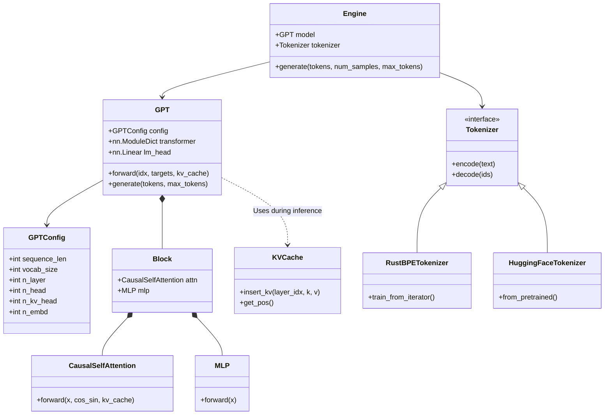
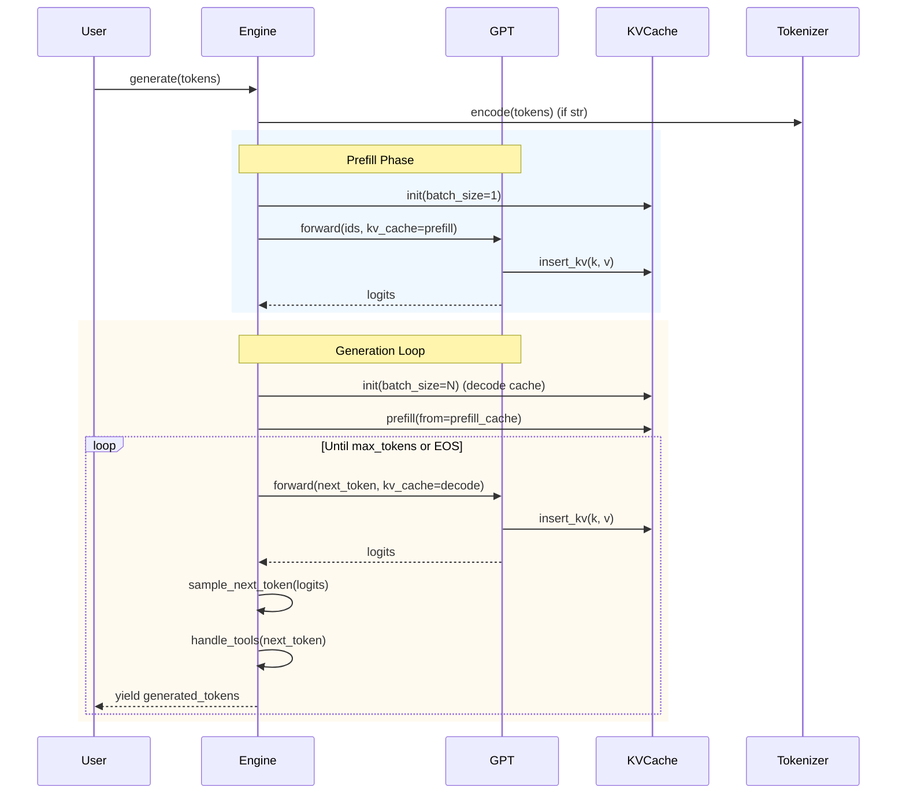

# Nanochat Codebase Overview

This document provides a high-level overview of the `nanochat` library, a lightweight and efficient implementation of GPT-style language models.

## System Architecture

`nanochat` is designed to be modular, efficient, and educational. It includes components for:
- **Model Architecture**: A simplified yet state-of-the-art GPT implementation.
- **Inference Engine**: An efficient generation engine with KV caching and tool use support.
- **Training Utilities**: Distributed optimizers (AdamW, Muon), data loading, and checkpoint management.
- **Evaluation**: Tools for evaluating model performance on standard benchmarks.

## Global Entity Relationship Diagram

The following class diagram illustrates the main classes and their relationships within the `nanochat` package.

## Inference Control Flow

The following sequence diagram shows the flow of data during text generation using the `Engine`.

## Module Descriptions

- **`gpt.py`**: Defines the `GPT` model, including `CausalSelfAttention` with RoPE and GQA, `MLP`, and `Block`.
- **`engine.py`**: Handles efficient inference, managing `KVCache` and tool execution (e.g., Python calculator).
- **`execution.py`**: safe-guarded execution environment for Python code generated by the model.
- **`tokenizer.py`**: Wrapper for tokenizers, supporting both HuggingFace and custom RustBPE implementations.
- **`dataset.py` / `dataloader.py`**: Handles downloading and streaming of the FineWeb-Edu dataset.
- **`adamw.py` / `muon.py`**: Custom distributed optimizers for training.
- **`common.py` / `checkpoint_manager.py`**: Utilities for distributed training setup, logging, and checkpointing.
- **`core_eval.py` / `loss_eval.py`**: Evaluation metrics and loop.
