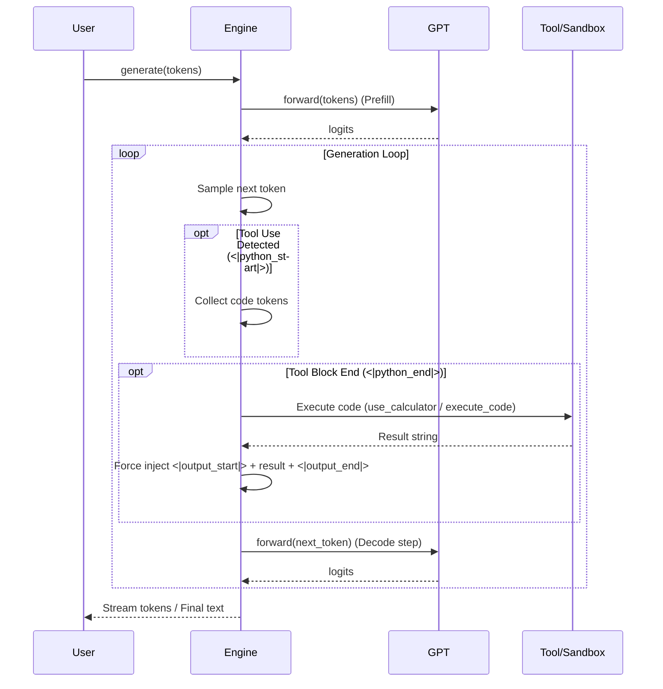

# Workflow: GPT, Engine, and Execution

This document explains the architecture and interaction between `gpt.py`, `engine.py`, and `execution.py` in the Nanochat codebase.

## Overview

The system is designed to generate text and code, and safely execute that code when needed (e.g., for calculator or Python tool use).

- **`gpt.py`**: Defines the Transformer language model (architecture, forward pass).
- **`engine.py`**: Manages the inference process. It handles token generation loops, managing KV caches, and the "tool use" state machine.
- **`execution.py`**: (Not currently used directly by `engine.py` but designed for this purpose) Provides a sandboxed environment to safely execute Python code generated by the model.

## Relationships

1.  **Engine uses GPT**: The `Engine` class is initialized with a `GPT` model instance. It calls `model.forward()` to get logits for the next token.
2.  **Engine manages State**: `Engine` implements a state machine (in `RowState`) to detect when the model outputs special tokens indicating code blocks (e.g., `<|python_start|>`).
3.  **Tool Execution**:
    - Currently, `engine.py` has a lightweight built-in calculator (`use_calculator`) for simple Python expressions.
    - `execution.py` offers a more robust, process-isolated sandbox (`execute_code`) which could be integrated into `engine.py` to replace or augment the simple calculator for safer and more complex code execution.

## detailed Flow Diagram

## Component Details

### `gpt.py`
- **Role**: The "Brain".
- **Key Classes**: `GPT`, `Block`, `CausalSelfAttention`, `MLP`.
- **Key Methods**: `forward(idx, ...)` computes potentials for the next token.
- **Features**: Flash Attention 3, Rotary Embeddings, Value Embeddings.

### `engine.py`
- **Role**: The "Manager".
- **Key Classes**: `Engine`, `KVCache`, `RowState`.
- **Key Methods**: 
    - `generate()`: Streaming generation with state management.
    - `sample_next_token()`: Logical sampling (temperature, top_k).
- **Tool Use**: Detects `<|python_start|>` and `<|python_end|>`. Currently uses a local `use_calculator` helper to `eval` safe expressions.

### `execution.py`
- **Role**: The "Sandbox".
- **Key Functions**: `execute_code`.
- **Key Features**:
    - Runs code in a separate process.
    - Enforces timeouts (default 5s).
    - Enforces memory limits (default 256MB).
    - Captures stdout/stderr.
    - Disables dangerous built-ins (filesystem, networking) via `reliability_guard`.

## Integration Note
While `execution.py` exists, `engine.py` currently uses a simpler `eval_with_timeout` inside `use_calculator`. A future improvement would be to have `engine.py` import and use `execution.execute_code` for all Python execution to ensure safety and isolation.
